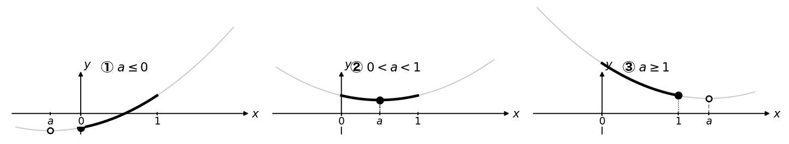

← [単元トップへ：二次関数の最大値・最小値](./index.md)

---

# 二次関数の最小値（固定区間）— 軸の位置が決め手になる3ケース

---

## 問題

\( 0 \leq x \leq 1 \) において、\( f(x) = x^2 - 2ax + 2a \) の最小値を求めよ。

---

## まず何を見るか

最初にすることは**平方完成**です。

\[
f(x) = (x - a)^2 + 2a - a^2
\]

これで、軸は \( x = a \)、頂点は \( (a,\ 2a - a^2) \) とわかります。

上に凸の放物線では、軸から離れるほど値が大きくなります。逆にいうと、**軸に最も近い点が最小値を与えます**。

ここで問題は「\( a \) がパラメータとして動く」という点です。\( a \) の値が変わるたびに軸 \( x = a \) の位置が変わるため、最小点の場所も変わります。だから「場合分け」が必要になります。

---

## 場合分けの根拠

軸 \( x = a \) が \( 0 \leq x \leq 1 \) の範囲に対してどこにあるか——この位置関係だけを見れば、最小点の場所は自然に決まります。

**軸が範囲の左側（\( a \leq 0 \)）**

軸は 0 より左にある。範囲内で軸に最も近いのは左端 \( x = 0 \)。\( f \) はこの範囲全体で単調増加しているため、左端が最小点になります。

**軸が範囲の内部（\( 0 < a < 1 \)）**

軸 \( x = a \) がちょうど範囲に入っている。この場合は頂点 \( x = a \) がそのまま範囲内に存在するため、頂点の値が最小値です。

**軸が範囲の右側（\( a \geq 1 \)）**

軸は 1 より右にある。範囲内で軸に最も近いのは右端 \( x = 1 \)。\( f \) はこの範囲全体で単調減少しているため、右端が最小点になります。

「軸の左では増加、軸の右では減少」という放物線の性質から、各ケースで最小点の場所は図を見ながら確認できます。

---

## 場合別の計算

**① \( a \leq 0 \) のとき**

軸 \( x = a \) は範囲の左側にある。最小点は左端 \( x = 0 \)（範囲内で軸に最も近いから）。

\[
f(0) = 2a
\]

**② \( 0 < a < 1 \) のとき**

軸が範囲の内部にあるから、頂点 \( x = a \) が最小点。

\[
f(a) = 2a - a^2 = a(2 - a)
\]

**③ \( a \geq 1 \) のとき**

軸 \( x = a \) は範囲の右側にある。最小点は右端 \( x = 1 \)（範囲内で軸に最も近いから）。

\[
f(1) = 1 - 2a + 2a = 1
\]

境界での整合：\( a = 0 \) では①②ともに \( 0 \)、\( a = 1 \) では②③ともに \( 1 \) になることを確認できます。

---

## まとめ

最小値をまとめると、

\[
\text{最小値} =
\begin{cases}
2a & (a \leq 0) \\[4pt]
a(2 - a) & (0 < a < 1) \\[4pt]
1 & (a \geq 1)
\end{cases}
\]

最小値は、軸が \( 0 \leq x \leq 1 \) の範囲のどこにあるかで決まる。

---

## もっと練習したい方へ

この問題を含む4問（固定区間2問・区間が動く2問）の解説PDFを無料で配布しています。模範解答と意味説明を2段組で並べた構成で、各ケースのグラフと照らしながら場合分けの流れを確認できます。

[PDFをダウンロードする（無料）](./assets/pdf/quadratic-max-min-pack.pdf)

---

→ [次の記事：最大値を求める（固定区間・軸が動く）](./quadratic-max-fixed-range.md)
